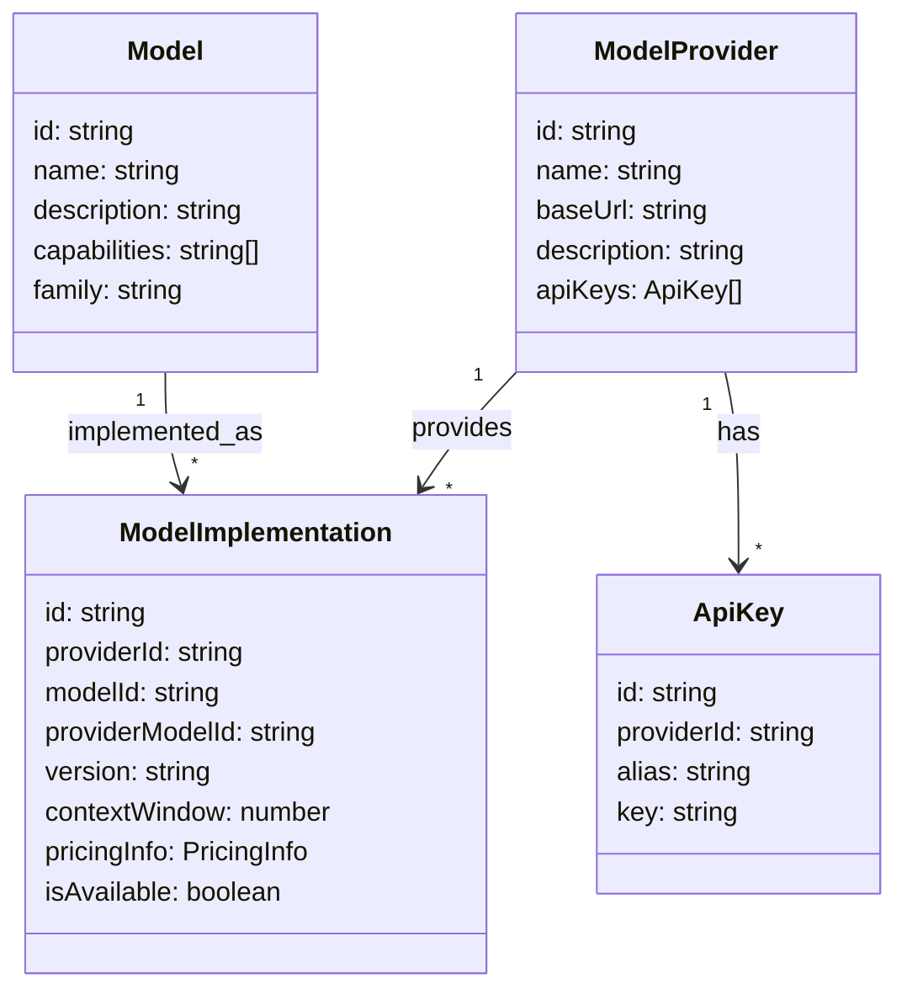

# My Agent

欢迎使用 **MyAgent** —— 一个基于 Python 开发的 Agent 框架。该项目旨在从零开始构建一个高效、易用的 Agent 框架，使开发者能够更简单、方便地使用和扩展 Agent 功能。

## 项目概述

**MyAgent** 的目标是为开发者提供一个灵活的工具，能够快速搭建、部署和自定义 Agent。通过这个框架，你可以：

- 轻松构建从简单到复杂的自动化 Agent。
- 整合多个外部 API 与系统，快速响应各种任务。
- 将 Agent 与现有项目无缝对接，提升整体系统智能化水平。

## 项目进度
目前处于项目最开始的阶段,很多功能还没有实现,欢迎大家一起来完善这个项目, 后续会逐步增加功能列表以及 TODO 列表。

### 已实现功能
- **模型提供商管理**：支持添加、编辑和删除不同的模型提供商（如OpenAI、Anthropic等）
- **API密钥管理**：每个提供商可配置多个API密钥，实现负载均衡和备份
- **模型管理**：支持管理不同的模型类型及其实现，包括模型能力、定价信息等
- **模型实现管理**：管理同一模型在不同提供商的不同实现版本

## 项目架构

### 前端技术栈
- React + TypeScript
- Ant Design UI组件库
- React Router用于路由管理
- Fetch API用于后端数据交互

### 后端技术栈
- FastAPI (Python)
- SQLAlchemy ORM
- PostgreSQL 数据库
- Alembic 数据库迁移

### 系统架构图
```
+-------------+        +------------+        +------------+
|             |  API   |            |  ORM   |            |
|  Web前端    | <----> |  后端API   | <----> |  数据库    |
|  (React)    |  调用  | (FastAPI)  |  操作  |(PostgreSQL)|
|             |        |            |        |            |
+-------------+        +------------+        +------------+
```

## 项目特点

- **Python 实现：** 利用 Python 的简洁性和生态系统的丰富性构建框架。
- **模块化设计：** 代码结构清晰，方便扩展和定制。
- **易用性高：** 从零开始构建 Agent 框架，让使用者能够快速上手。
- **开放源代码：** 欢迎社区贡献，共同完善功能。
- **完整测试覆盖：** 前后端均有单元测试和集成测试保证质量。

## 数据模型图


## 环境要求

- Python 3.7 或以上版本
- Node.js 14.0 或以上版本
- PostgreSQL 13.0 或以上版本
- 推荐使用虚拟环境（如 `venv` 或 `virtualenv`）

## 安装指南

1. **克隆项目仓库：**

   ```bash
   git clone https://github.com/V1ki/MyAgent.git
   cd MyAgent
   ```

2. **后端设置：**

   ```bash
   cd api
   pip install -r requirements.txt
   cp .env.example .env  # 配置环境变量
   alembic upgrade head  # 执行数据库迁移
   uvicorn app.main:app --reload  # 启动后端服务
   ```

3. **前端设置：**

   ```bash
   cd web
   npm install
   npm run dev  # 启动开发服务器
   ```

4. **设置环境变量：**
```bash  
cp .env.example .env
``` 
在 `.env` 文件中，你可以设置各种环境变量，各种 API 的密钥等.
这里需要注意的是`DEFAULT_MODEL`这个值的设置方式为:`VENDOR:MODEL`，比如`openai:gpt-3.5-turbo`。

## 贡献指南

我们欢迎并鼓励社区贡献！如果你有好的想法或任何问题，请按照以下步骤进行贡献：

1. Fork 本项目仓库
2. 创建新分支：
```bash
git checkout -b feature/你的功能名称
```
3. 提交更改：
```bash
git commit -m "添加了XXX功能/修复了XXX问题"
```

4. 推送到分支：
```bash
git push origin feature/你的功能名称
```

5. 提交 Pull Request, 并描述你的更改。

## 许可证
本项目遵循 MIT 许可证，详情请参阅 LICENSE 文件。


## 联系方式
如有疑问、建议或反馈，欢迎通过以下方式联系：

- **GitHub Issues**： [MyAgent Issues](https://github.com/V1ki/MyAgent/issues)

感谢你对 MyAgent 的支持. 🎉
