# 多模型对比聊天界面设计方案

## 1. 概述

本文档描述了一个基于现有模型提供商、API Key、模型和模型实现组件的聊天界面系统。该系统不仅支持基本的聊天功能，还允许用户同时选择多个模型对同一问题进行回答，比较不同模型的响应质量，并可以选择某个特定模型的回答作为后续对话的上下文。系统还支持高级功能如每轮对话参数独立设置、提问编辑与版本历史管理等。

## 2. 系统架构

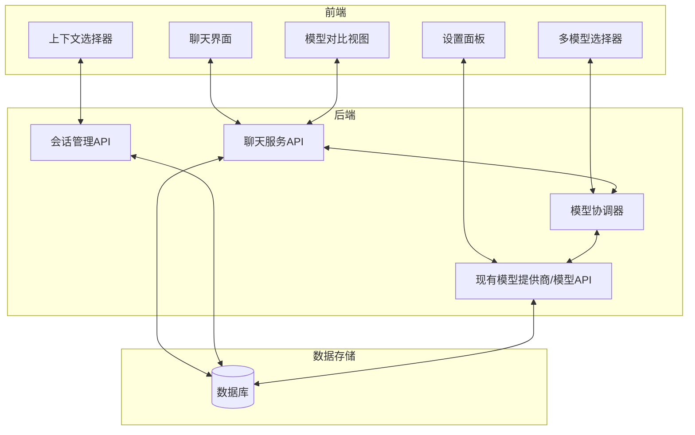

## 3. 数据模型

### 3.1 核心数据模型

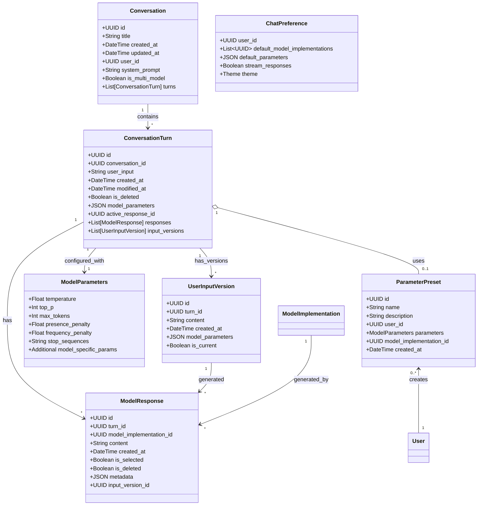

### 3.2 与现有模型的关系

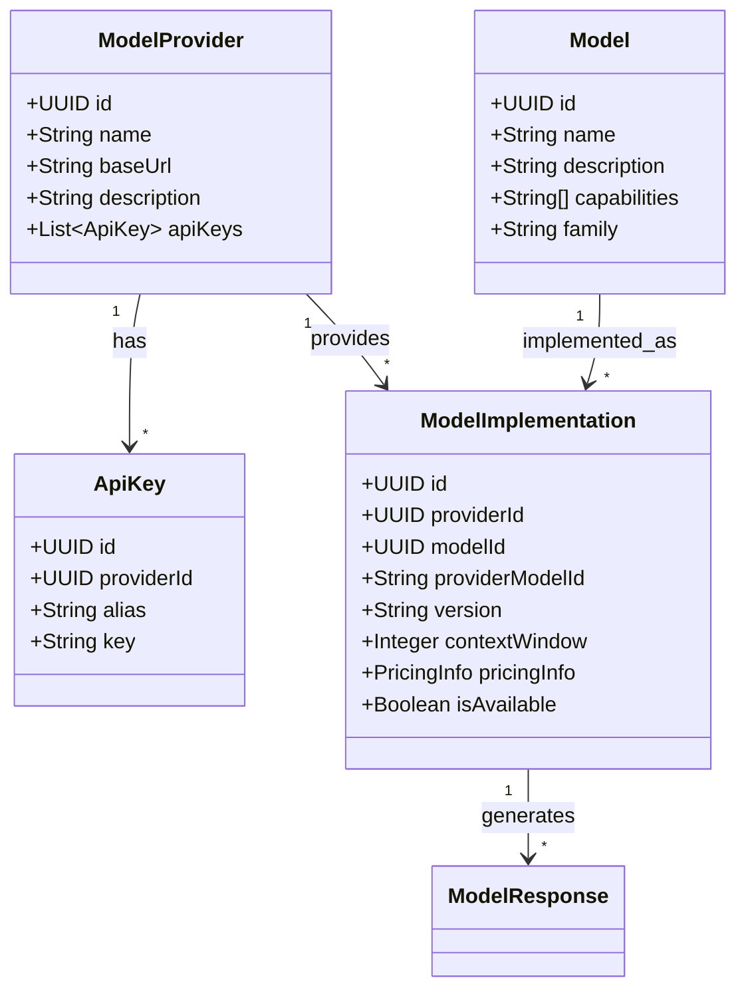

## 4. 前端界面设计

### 4.1 页面布局

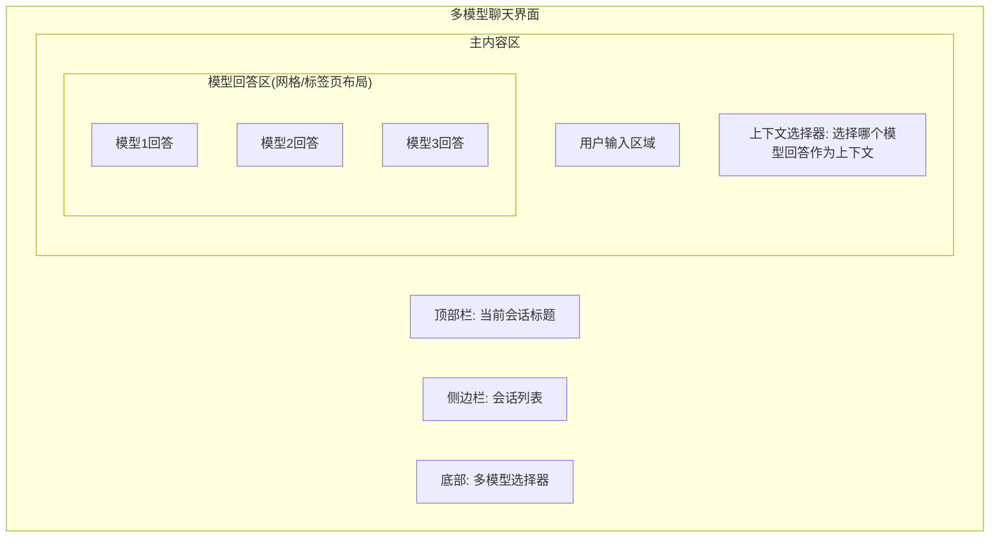

### 4.2 对话轮次组件结构

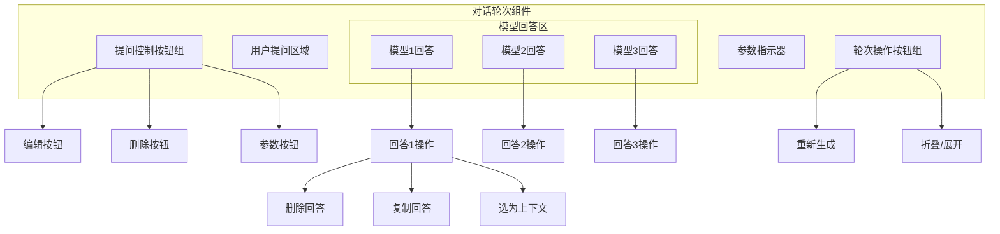

### 4.3 参数设置面板

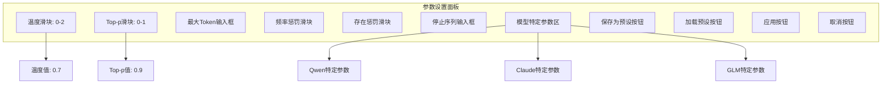

## 5. 关键流程

### 5.1 多模型同时回答流程

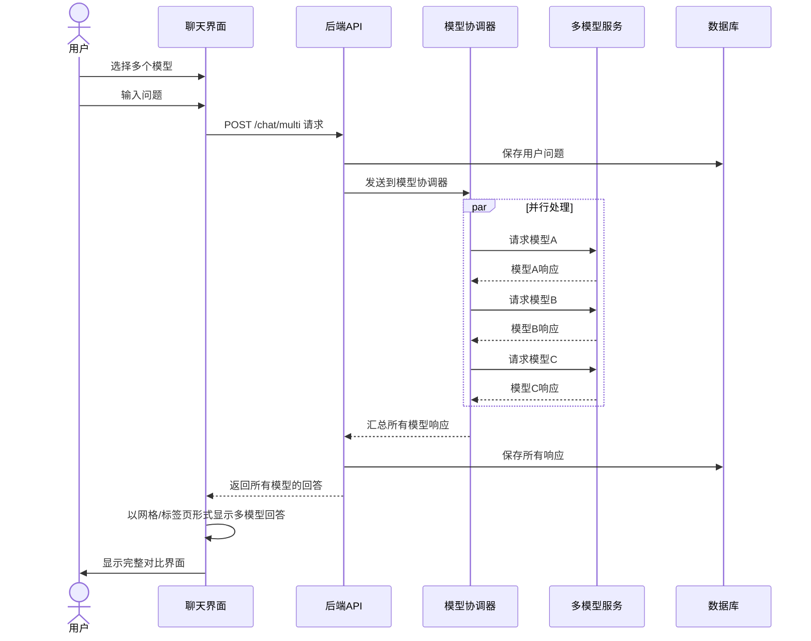

### 5.2 流式响应处理

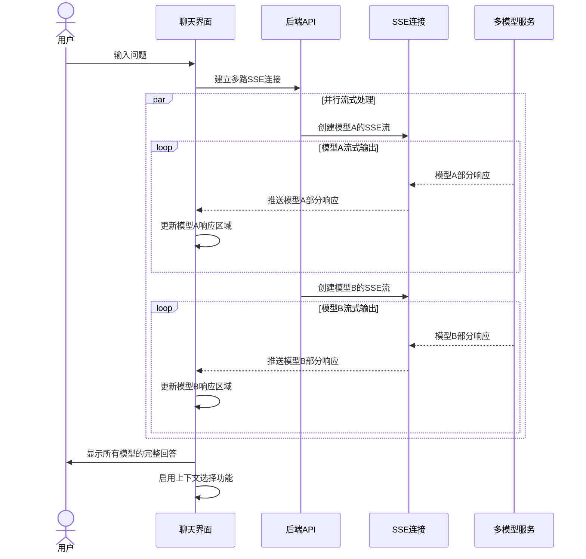

### 5.3 编辑提问并保留历史版本

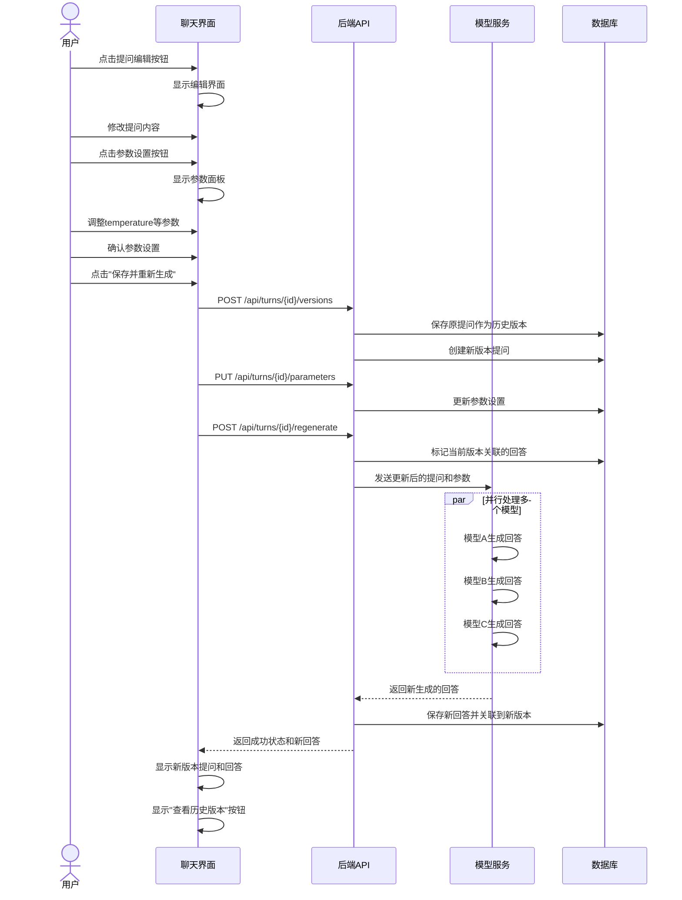

### 5.4 提问版本切换流程

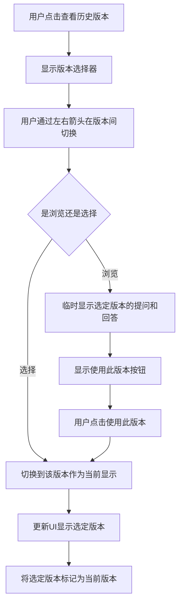

### 5.5 删除回答后的上下文管理

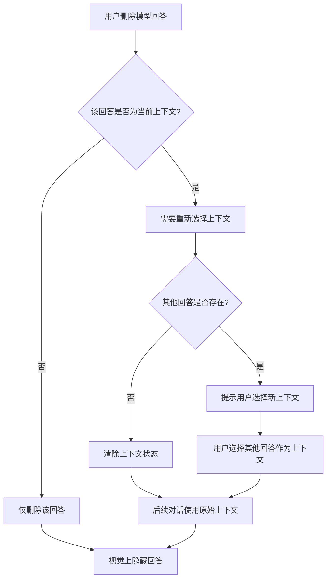

## 6. API接口设计

### 6.1 多模型聊天接口

```
POST /api/chat/multi
GET /api/conversations/{id}/turns
POST /api/conversations/{id}/turns
PUT /api/conversations/{id}/turns/{turn_id}/select-response/{response_id}
```

### 6.2 流式响应接口

```
GET /api/chat/multi/stream?models=model1,model2,model3&message=<message>
```

### 6.3 编辑与版本管理接口

```
// 提问版本管理
POST /api/turns/{turn_id}/versions           // 创建新版本
GET /api/turns/{turn_id}/versions            // 获取所有版本
GET /api/turns/{turn_id}/versions/{version_id}  // 获取特定版本
PUT /api/turns/{turn_id}/versions/{version_id}/set-current  // 设置当前版本

// 参数管理
PUT /api/turns/{turn_id}/parameters
DELETE /api/turns/{turn_id}
DELETE /api/responses/{response_id}
POST /api/turns/{turn_id}/regenerate
```

### 6.4 参数预设管理接口

```
GET /api/parameter-presets
POST /api/parameter-presets
GET /api/parameter-presets/{id}
PUT /api/parameter-presets/{id}
DELETE /api/parameter-presets/{id}
```

## 7. 用户界面元素

### 7.1 提问编辑与参数设置UI

当用户点击编辑按钮时，提问区域转变为可编辑状态，并在底部显示参数设置按钮：

```
┌─────────────────────────────────────────────────────────┐
│ [用户头像]                                     12:34 PM │
│                                                         │
│ ┌─────────────────────────────────────────────────────┐ │
│ │ [编辑框] 我想了解大型语言模型的内部工作原理...     │ │
│ │                                                     │ │
│ │                                                     │ │
│ └─────────────────────────────────────────────────────┘ │
│                                                         │
│ ┌─────────────┐ ┌──────────┐ ┌───────────────────────┐ │
│ │ 参数设置 ⚙️ │ │ 取消编辑 │ │ 保存并重新生成回答 ▶ │ │
│ └─────────────┘ └──────────┘ └───────────────────────┘ │
└─────────────────────────────────────────────────────────┘
```

### 7.2 参数设置面板UI

```
┌─────────────────────────────────────────────────────────┐
│ 生成参数设置                                    [关闭] │
├─────────────────────────────────────────────────────────┤
│                                                         │
│ Temperature                                             │
│ [····●···················································] │
│ 0.7                                                     │
│                                                         │
│ Top-p                                                   │
│ [····················●·······························] │
│ 0.9                                                     │
│                                                         │
│ Max Tokens                                              │
│ [______2048______]                                      │
│                                                         │
│ Frequency Penalty                                       │
│ [··············●·········································] │
│ 0.5                                                     │
│                                                         │
│ ➕ 更多参数                                             │
│                                                         │
│ 预设: [默认参数 ▼]  [保存为新预设]                     │
│                                                         │
│ ┌──────────┐ ┌──────────────────────────┐              │
│ │   取消   │ │ 应用到当前提问并保存 ✓  │              │
│ └──────────┘ └──────────────────────────┘              │
└─────────────────────────────────────────────────────────┘
```

### 7.3 提问版本历史管理UI

提问被编辑时，显示版本历史：

```
┌─────────────────────────────────────────────────────────┐
│ [用户头像]                             12:34 PM (已编辑) │
│                                                         │
│ 我想了解大型语言模型的工作原理和训练方法...            │
│                                                         │
│ ┌───────────────────────────────────────────────────┐   │
│ │ 版本 3/3  ◀ ▶   版本历史                         │   │
│ └───────────────────────────────────────────────────┘   │
└─────────────────────────────────────────────────────────┘
```

版本历史查看界面：

```
┌─────────────────────────────────────────────────────────┐
│ 提问历史版本                                    [关闭] │
├─────────────────────────────────────────────────────────┤
│                                                         │
│ 版本 2/3   ◀ 前一版本 | 后一版本 ▶                    │
│                                                         │
│ 创建时间: 2023-06-15 14:23                             │
│                                                         │
│ 我想了解大型语言模型的工作机制和应用领域...            │
│                                                         │
│ 参数:                                                  │
│ Temperature: 0.7                                        │
│ Top-p: 0.9                                              │
│ Max Tokens: 2048                                        │
│                                                         │
│ ┌────────────────────┐ ┌────────────────────────────┐  │
│ │ 预览此版本的回答  │ │ 将此版本设为当前版本 ✓    │  │
│ └────────────────────┘ └────────────────────────────┘  │
└─────────────────────────────────────────────────────────┘
```

### 7.4 已删除和已编辑消息的显示

提问被删除时：
```
┌─────────────────────────────────────────────────────────┐
│ [用户头像]                                     12:34 PM │
│                                                         │
│ 此消息已删除                      [恢复] [永久删除]     │
└─────────────────────────────────────────────────────────┘
```

提问被编辑时：
```
┌─────────────────────────────────────────────────────────┐
│ [用户头像]                             12:34 PM (已编辑) │
│                                                         │
│ 我想了解大型语言模型的工作原理和训练方法...            │
│                                                         │
│ [查看编辑历史]                                          │
└─────────────────────────────────────────────────────────┘
```

## 8. 实现计划

### 8.1 阶段一：基础多模型对比功能
1. 创建会话和对话轮次数据结构
2. 实现多模型选择器
3. 开发基础多模型聊天界面
4. 实现并行模型调用机制

### 8.2 阶段二：上下文选择功能
1. 增加上下文选择UI
2. 实现上下文选择逻辑
3. 修改后端以支持上下文选择

### 8.3 阶段三：高级功能和优化
1. 增加流式响应支持
2. 实现提问编辑和版本历史功能
3. 添加参数设置和预设管理
4. 优化多模型响应的并发处理
5. 添加响应比较工具
6. 支持不同的回答视图布局
7. 实现提问版本切换功能

## 9. 性能与可用性考虑

### 9.1 长会话处理

对于长对话历史，实施渐进式加载和虚拟滚动，确保界面响应迅速：

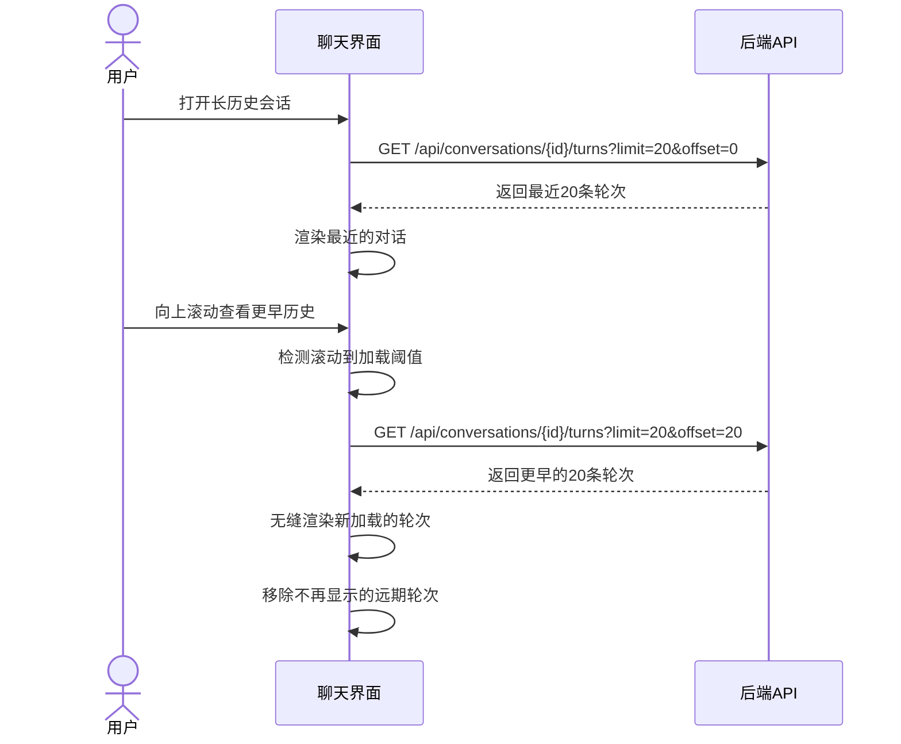

## 10. Agent整合准备

多模型对比聊天界面为后续Agent功能奠定了基础：

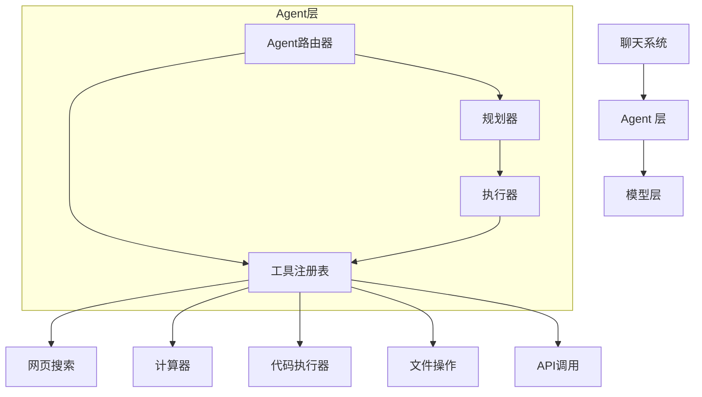

Agent整合优势：

1. **参数优化** - 用户可以针对不同任务调整参数，找出最佳Agent配置
2. **会话修正** - 当Agent理解错误时，用户可以编辑提问澄清意图
3. **工具调用精确性** - 通过删除错误响应，确保Agent使用正确的上下文调用工具
4. **效果对比** - 比较不同参数设置对Agent工具使用的影响
5. **模型专长识别** - 根据比较结果为不同任务选择最适合的模型
6. **混合Agent设计** - 利用不同模型的优势构建复合Agent

## 11. 结论

这个多模型对比聊天界面设计提供了对话系统的完整解决方案，不仅支持基本的聊天功能，还具有以下高级特性：

1. 同时向多个模型提问并比较响应
2. 为每个对话轮次独立配置参数
3. 提问编辑与版本历史管理，可随时查看和切换历史版本
4. 选择特定模型回答作为上下文
5. 参数预设管理
6. 流式响应处理

这些功能共同确保用户可以维护高质量的对话历史，防止错误提问影响后续交互，同时通过参数微调充分发挥模型潜力。提问历史版本管理功能特别有助于用户比较不同提问方式对AI回答的影响，为用户提供更灵活的对话修改和实验能力。设计保持了用户友好性，同时为后续Agent功能扩展提供了灵活基础。