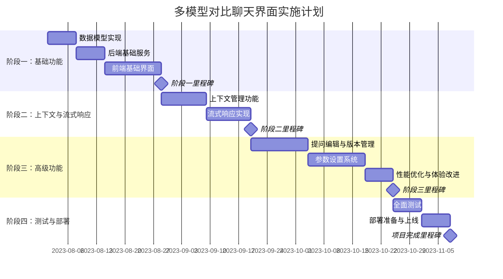

# 多模型对比聊天界面实施计划

## 1. 项目概述

基于设计文档，我们将实现一个支持多模型对比、提问版本管理和参数微调的聊天界面。该系统允许用户同时向多个模型提问，比较回答质量，并灵活选择后续对话的上下文。

## 2. 项目阶段与任务分解

### 2.1 阶段一：基础功能（估计4周）

1. **数据模型实现** (1周)
   - 设计并实现会话、轮次、响应等核心数据结构
   - 实现模型提供商、API密钥管理功能
   - 创建数据库迁移和初始化脚本

2. **后端基础服务** (1周)
   - 实现会话管理API
   - 开发多模型协调器
   - 集成现有模型API连接器

3. **前端基础界面** (2周)
   - 开发对话界面组件
   - 实现多模型选择器
   - 创建模型响应对比视图
   - 构建会话列表和管理界面

### 2.2 阶段二：上下文与流式响应（估计3周）

1. **上下文管理功能** (1.5周)
   - 实现上下文选择UI组件
   - 开发上下文切换逻辑
   - 修改后端以支持动态上下文选择

2. **流式响应实现** (1.5周)
   - 添加服务器发送事件(SSE)支持
   - 开发并行流式响应处理
   - 实现前端流式更新组件

### 2.3 阶段三：高级功能（估计5周）

1. **提问编辑与版本管理** (2周)
   - 实现提问编辑UI
   - 开发版本历史功能
   - 创建版本切换与比较界面

2. **参数设置系统** (2周)
   - 开发参数调整界面
   - 实现参数预设管理
   - 创建每轮参数独立配置功能

3. **性能优化与体验改进** (1周)
   - 实现长对话历史虚拟滚动
   - 优化多模型并发调用
   - 改进响应对比UI布局

### 2.4 阶段四：测试与部署（估计2周）

1. **全面测试** (1周)
   - 单元测试与集成测试
   - 用户体验测试
   - 性能与负载测试

2. **部署准备与上线** (1周)
   - 环境配置与部署脚本
   - 监控与日志系统配置
   - 正式环境部署与验证

## 3. 项目甘特图

## 4. 测试计划

### 4.1 单元测试

| 组件 | 测试内容 | 预期结果 |
|------|---------|---------|
| 多模型协调器 | 模型调用与响应处理 | 所有模型正确接收请求并返回响应 |
| 上下文管理器 | 上下文切换逻辑 | 上下文状态正确保持并传递到后续对话 |
| 版本历史系统 | 版本创建与切换 | 提问版本正确保存并可切换查看 |

### 4.2 集成测试

| 测试场景 | 测试步骤 | 预期结果 |
|---------|---------|---------|
| 完整对话流程 | 创建会话、提问、接收多模型回答、选择上下文、继续对话 | 整个流程顺畅，状态正确传递 |
| 参数调整与重生成 | 修改提问参数并重新生成回答 | 参数正确应用并影响模型输出 |
| 错误处理与恢复 | 模拟模型API错误和网络问题 | 系统正确处理错误并提供恢复选项 |

### 4.3 性能测试

- 并发用户支持：同时支持至少50个活跃用户会话
- 响应时间：UI交互响应时间不超过100ms
- 多模型调用：支持同时调用5个以上模型且不降低系统稳定性

## 5. 资源规划

### 5.1 开发团队配置

| 角色 | 人数 | 主要职责 |
|------|------|---------|
| 前端开发 | 2 | React组件开发、状态管理、UI/UX实现 |
| 后端开发 | 2 | API实现、数据库管理、模型集成 |
| 全栈开发 | 1 | 跨层功能协调、技术决策 |
| UI/UX设计 | 1 | 界面设计、原型制作、用户体验优化 |
| QA工程师 | 1 | 测试用例设计、自动化测试、质量保障 |

### 5.2 技术栈选择

| 层面 | 技术选择 | 理由 |
|------|---------|------|
| 前端框架 | React + TypeScript | 组件化开发，类型安全 |
| 状态管理 | Redux + Redux Toolkit | 复杂状态管理，支持异步操作 |
| UI组件库 | Ant Design | 丰富的企业级组件，高度可定制 |
| 后端框架 | FastAPI | 高性能异步API，自动文档生成 |
| 数据库 | PostgreSQL | 事务支持，JSON数据类型适合存储对话历史 |
| 缓存系统 | Redis | 高性能缓存，支持发布订阅模式适合SSE |

## 6. 风险管理

| 风险 | 影响 | 可能性 | 缓解策略 |
|------|------|-------|---------|
| 模型API限流与费用 | 高 | 中 | 实现智能请求队列，添加模型调用预算控制 |
| 复杂UI导致性能问题 | 中 | 高 | 组件懒加载，虚拟滚动，状态优化 |
| 提问编辑导致上下文不一致 | 高 | 中 | 完善版本追踪逻辑，明确标识关联响应 |
| 并发流式响应管理复杂 | 中 | 高 | 增量开发与测试，添加断路保护 |

## 7. Agent整合路径

完成多模型对比聊天界面后，我们将按以下路径扩展为完整Agent系统：

1. **工具集成准备** (估计2周)
   - 设计与实现工具注册表
   - 创建工具调用标准接口
   - 开发基础工具（计算器、网络搜索、代码执行）

2. **Agent规划与执行** (估计3周)
   - 实现规划器组件
   - 开发执行器模块
   - 创建Agent路由逻辑

3. **工具使用监控与调试** (估计2周)
   - 设计工具使用可视化界面
   - 实现调试与微调功能
   - 开发工具调用历史追踪

4. **专业化Agent模板** (估计2周)
   - 创建领域特定Agent配置
   - 开发任务特化参数预设
   - 实现Agent性能分析面板

## 8. 部署与发布计划

### 8.1 环境配置

1. 开发环境：供团队开发与单元测试
2. 测试环境：用于集成测试与QA验证
3. 预发环境：限制用户测试与性能评估
4. 生产环境：最终用户访问环境

### 8.2 发布策略

1. **Alpha版本**：完成阶段一功能，内部团队测试
2. **Beta版本**：完成阶段二功能，邀请有限用户测试
3. **公测版本**：完成阶段三功能，开放更多用户测试
4. **正式版本**：完成全部测试与优化，正式发布

### 8.3 监控与维护

- 实施全面日志系统，记录关键操作与错误
- 配置性能监控，追踪API延迟与资源使用
- 建立自动报警机制，及时响应异常情况
- 规划定期维护窗口，进行系统更新与优化

## 9. 结论

本实施计划详细描述了多模型对比聊天界面的开发路径，从基础功能到高级特性的逐步实现。通过分阶段开发策略，我们可以在确保质量的同时，逐步交付有价值的功能。团队将按照甘特图所示时间线推进项目，并定期评估进度与风险。完成这一系统后，我们将拥有强大的基础平台，可进一步扩展为全功能Agent系统。
