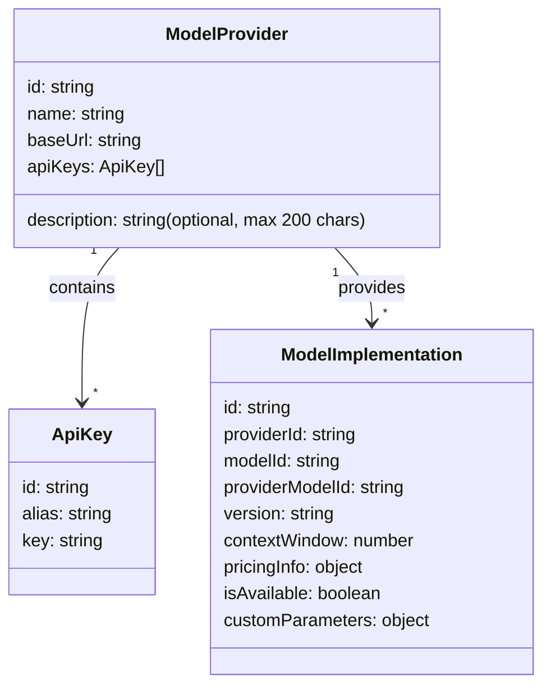
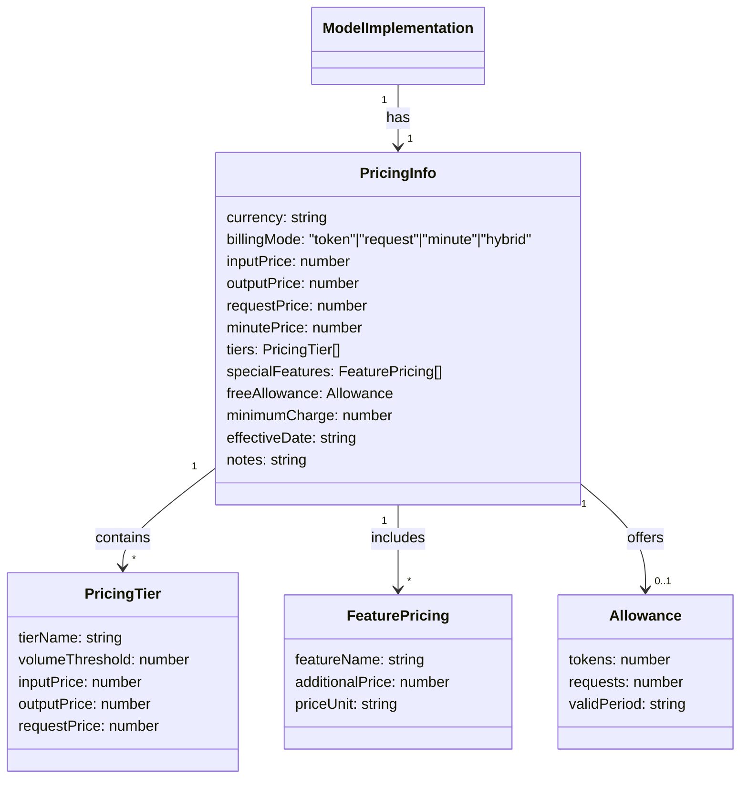
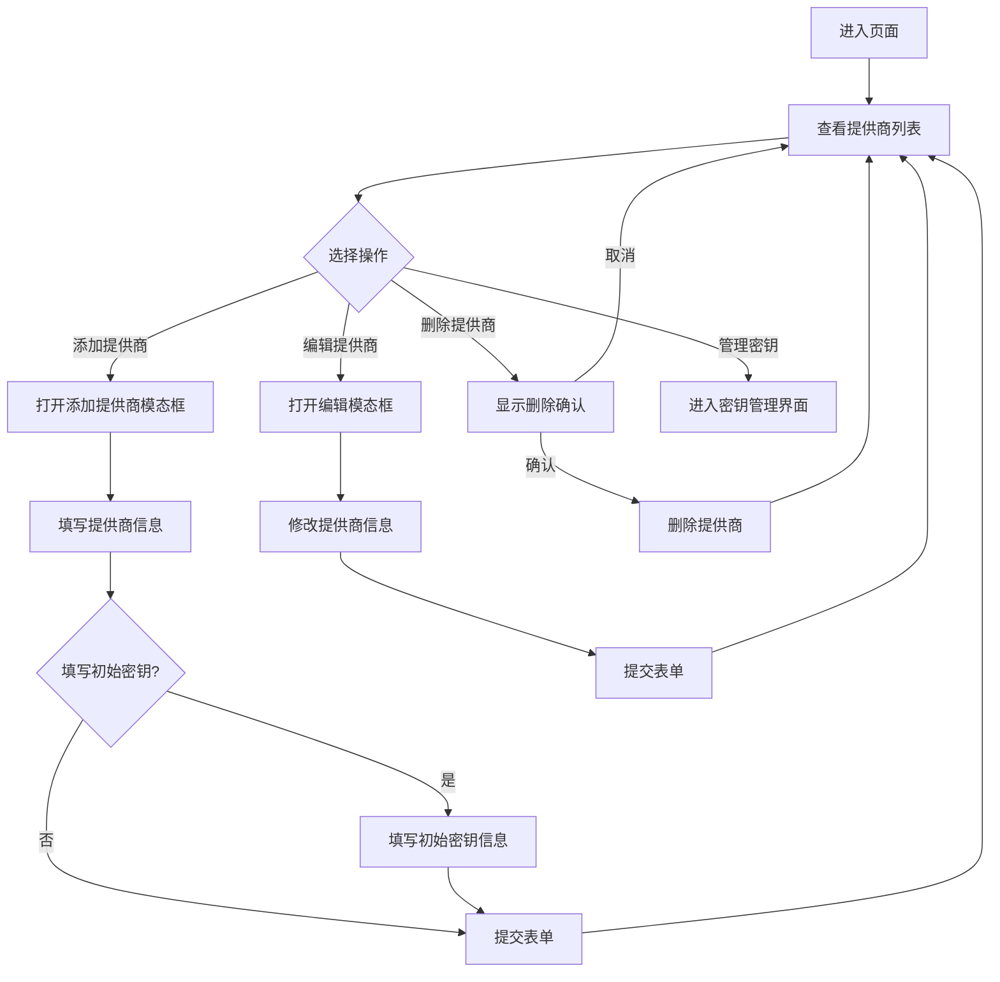
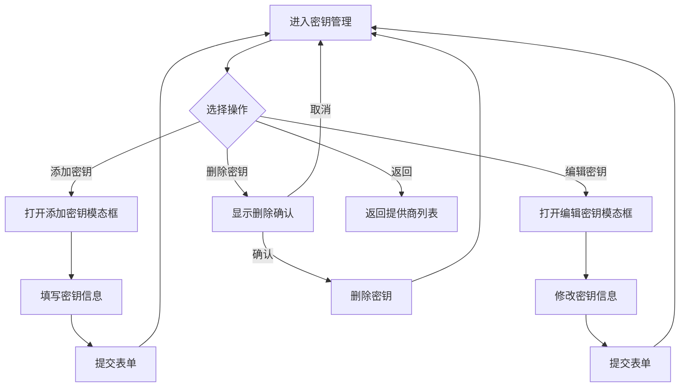

# 模型提供商相关功能设计

## 数据模型类图


### 关于 `PricingInfo` 的一些考虑


```TypeScript
interface PricingInfo {
  // 基础计费信息
  currency: string; // 货币单位，如 "USD", "CNY"
  billingMode: "token" | "request" | "minute" | "hybrid"; // 计费模式
  
  // 基于Token的计费
  inputPrice?: number; // 每千输入token的价格
  outputPrice?: number; // 每千输出token的价格
  
  // 基于请求的计费
  requestPrice?: number; // 每次请求的价格
  
  // 基于时间的计费（如语音/视频模型）
  minutePrice?: number; // 每分钟的价格
  
  // 分级定价
  tiers?: {
    tierName: string; // 如 "Free", "Standard", "Premium"
    volumeThreshold: number; // 用量阈值
    inputPrice?: number; // 此级别的输入价格
    outputPrice?: number; // 此级别的输出价格
    requestPrice?: number; // 此级别的请求价格
  }[];
  
  // 附加功能定价
  specialFeatures?: {
    featureName: string; // 如 "function-calling", "vision", "embedding"
    additionalPrice: number; // 附加价格
    priceUnit: string; // 价格单位，如 "per request", "per 1K tokens"
  }[];
  
  // 免费额度信息
  freeAllowance?: {
    tokens?: number; // 免费token数量
    requests?: number; // 免费请求数量
    validPeriod?: string; // 有效期，如 "daily", "monthly"
  };
  
  // 额外信息
  minimumCharge?: number; // 最小收费金额
  effectiveDate?: string; // 价格生效日期
  notes?: string; // 额外说明
}
```


## 提供商管理流程图



## API密钥管理流程图


## 组件状态管理
该组件使用`React`的`useState`钩子管理以下状态:

- `providers`: `ModelProvider`对象数组
- `isModalVisible`: 提供商模态框是否可见
- `isKeyModalVisible`: 密钥模态框是否可见
- `editingProviderId`: 正在编辑的提供商ID(为`null`时表示新增)
- `currentProvider`: 当前正在管理密钥的提供商
- `editingKeyId`: 正在编辑的密钥ID(为`null`时表示新增)