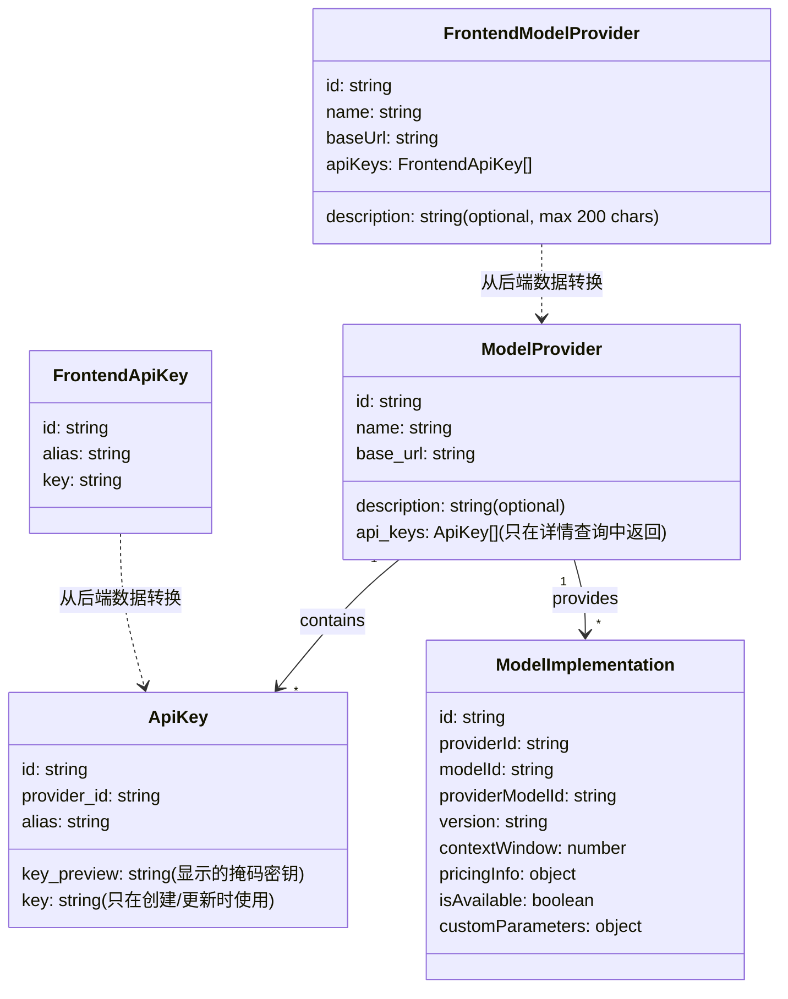
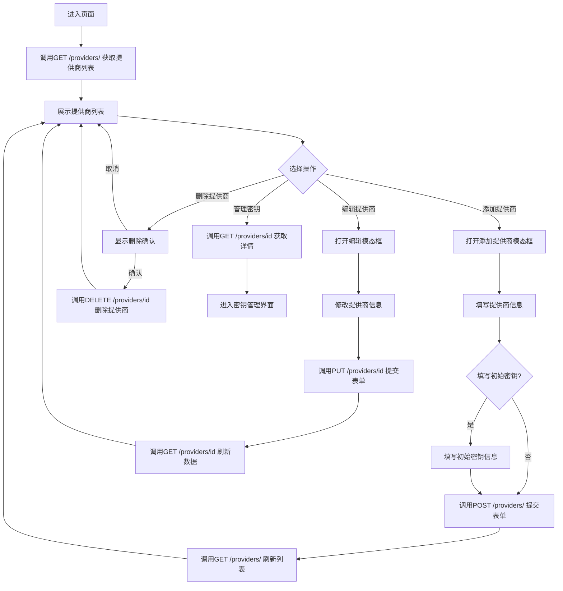
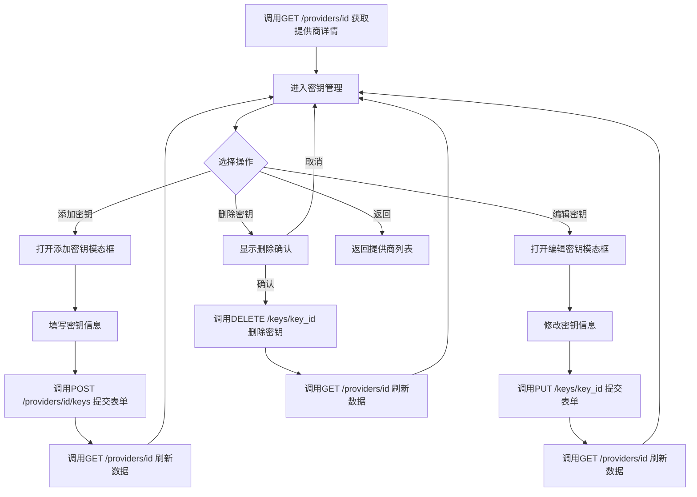
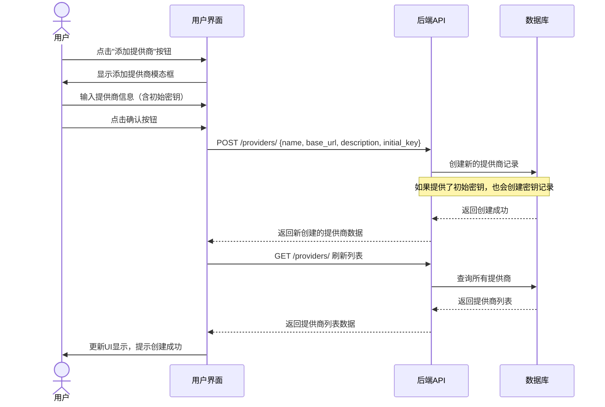
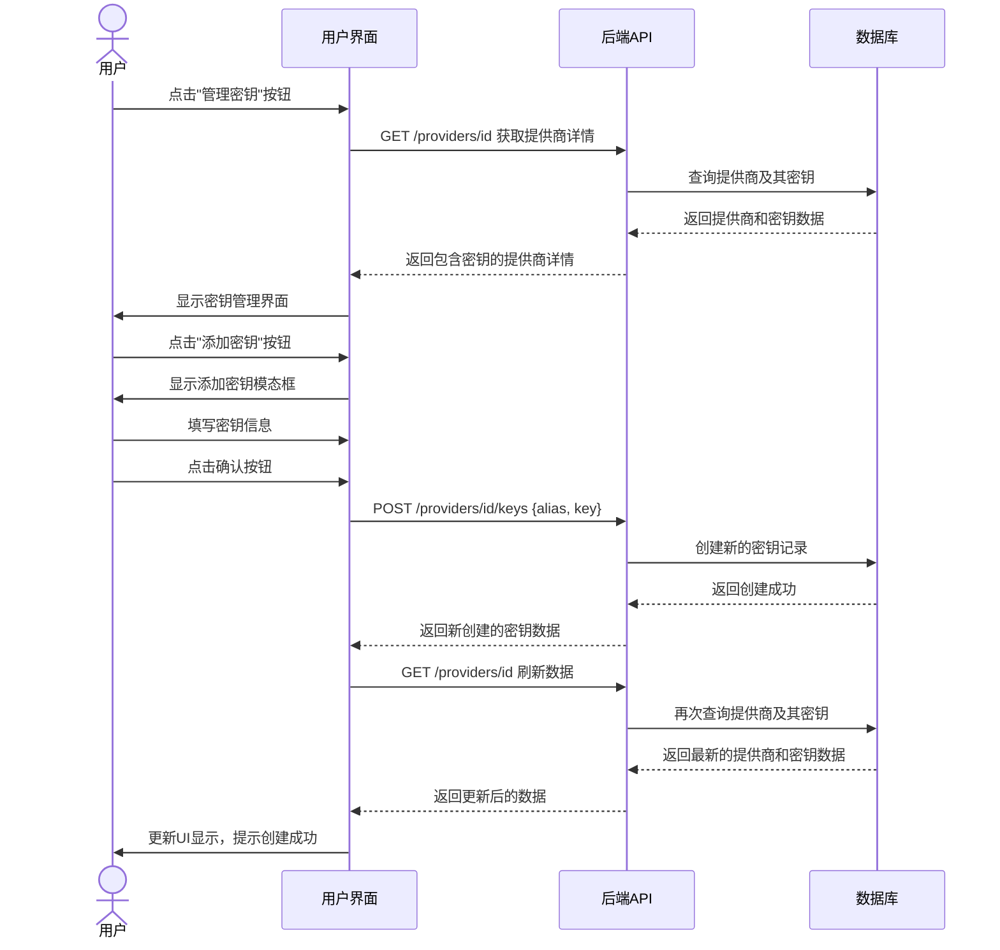

# 模型提供商相关功能设计

## 数据模型类图


## 后端API集成
该组件使用原生的Fetch API与后端进行交互，替换了原来的硬编码数据模式。主要使用以下API端点：

### 提供商API

- `GET /providers/` - 获取所有提供商列表
- `GET /providers/{provider_id}` - 获取单个提供商及其API密钥详情
- `POST /providers/` - 创建新的提供商
- `PUT /providers/{provider_id}` - 更新提供商信息
- `DELETE /providers/{provider_id}` - 删除提供商

### API密钥API

- `GET /providers/{provider_id}/keys` - 获取提供商的所有API密钥
- `POST /providers/{provider_id}/keys` - 为提供商添加新的API密钥
- `PUT /keys/{key_id}` - 更新API密钥信息
- `DELETE /keys/{key_id}` - 删除API密钥

## 提供商管理流程图（带API调用）


## API密钥管理流程图（带API调用）


## 添加提供商的序列图


## 管理密钥的序列图


## 错误处理

该组件实现了完善的错误处理机制：

- 加载状态显示（使用`loading`状态）
- API请求错误处理（错误信息展示与重试功能）
- 表单验证错误处理
- 用户操作反馈（成功/失败消息）

## 组件状态管理
该组件使用`React`的`useState`钩子管理以下状态:
- `providers`: `FrontendModelProvider`对象数组
- `loading`: 表示正在进行API请求
- `error`: 保存API请求错误信息
- `isModalVisible`: 提供商模态框是否可见
- `isKeyModalVisible`: 密钥模态框是否可见
- `editingProviderId`: 正在编辑的提供商ID(为`null`时表示新增)
- `currentProvider`: 当前正在管理密钥的提供商
- `editingKeyId`: 正在编辑的密钥ID(为`null`时表示新增)

## 主要组件结构

```
ModelProviders/
  ├── index.tsx                  # 模型提供商页面主入口
  ├── ModelProviders.test.tsx    # 组件测试文件
  ├── Readme.md                  # 组件文档
  │
  ├── components/
  │   ├── ProviderList.tsx       # 提供商列表组件
  │   ├── ProviderForm.tsx       # 提供商添加/编辑表单
  │   ├── ProviderDetail.tsx     # 提供商详情展示
  │   ├── ApiKeyList.tsx         # API密钥列表组件
  │   └── ApiKeyForm.tsx         # API密钥添加/编辑表单
  │
  ├── hooks/
  │   ├── useProviders.tsx       # 提供商数据管理钩子
  │   └── useApiKeys.tsx         # API密钥管理钩子
  │
  └── types/
      └── index.ts               # 类型定义文件
```

基本组件结构说明:

1. **index.tsx**: 主页面组件，负责整体布局与状态管理，协调子组件之间的交互。

2. **组件层 (components/)**: 
   - **ProviderList**: 展示所有模型提供商，支持搜索、排序，与选择操作
   - **ProviderForm**: 用于创建和编辑提供商信息的表单组件，包含验证逻辑
   - **ProviderDetail**: 展示提供商详细信息，包括相关API密钥列表
   - **ApiKeyList**: 展示指定提供商的API密钥列表
   - **ApiKeyForm**: 用于添加和编辑API密钥的表单组件

3. **Hooks层 (hooks/)**: 
   - **useProviders**: 封装与提供商相关的状态管理和API调用
   - **useApiKeys**: 封装与API密钥相关的状态管理和API调用

4. **服务层 (services/)**: 
   - **providerService**: 处理与后端提供商API的通信
   - **apiKeyService**: 处理与后端API密钥相关的API调用

5. **类型定义 (types/)**: 
   - 定义前端使用的所有类型，包括提供商、API密钥等TS接口