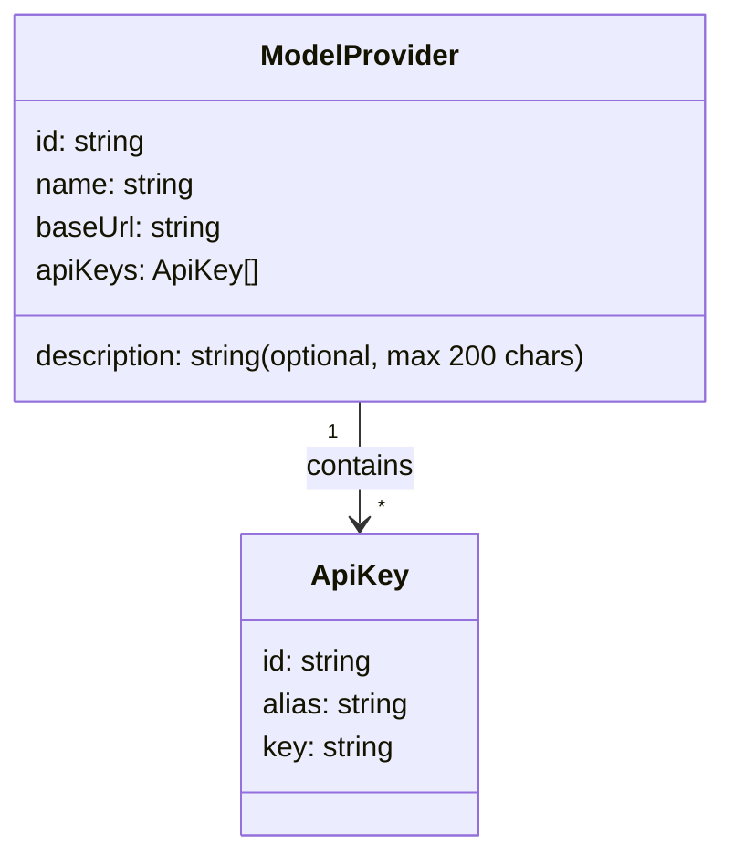
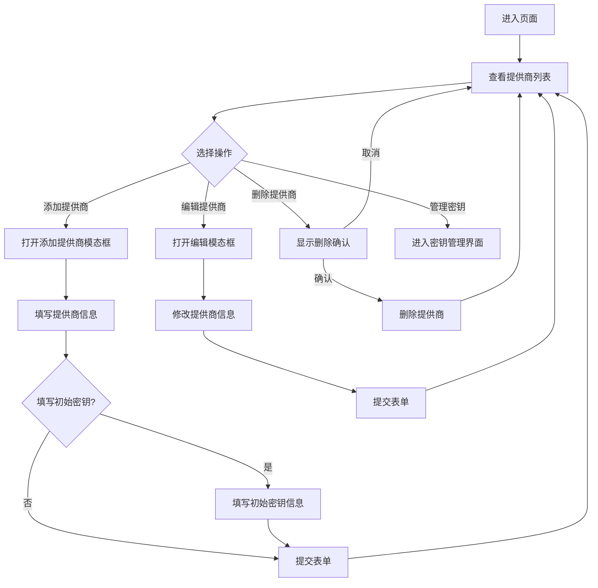

# 模型提供商相关功能设计

## 数据模型类图

## 提供商管理流程图

## 组件状态管理
该组件使用`React`的`useState`钩子管理以下状态:

- `providers`: `ModelProvider`对象数组
- `isModalVisible`: 提供商模态框是否可见
- `isKeyModalVisible`: 密钥模态框是否可见
- `editingProviderId`: 正在编辑的提供商ID(为`null`时表示新增)
- `currentProvider`: 当前正在管理密钥的提供商
- `editingKeyId`: 正在编辑的密钥ID(为`null`时表示新增)