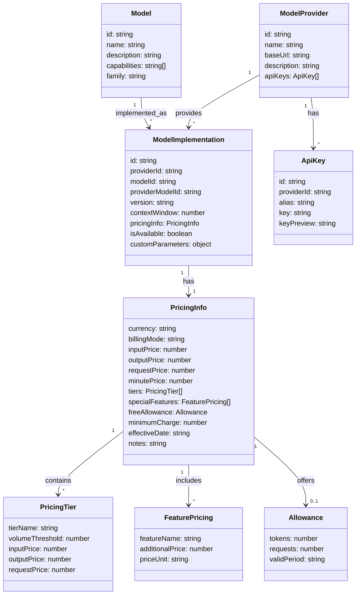
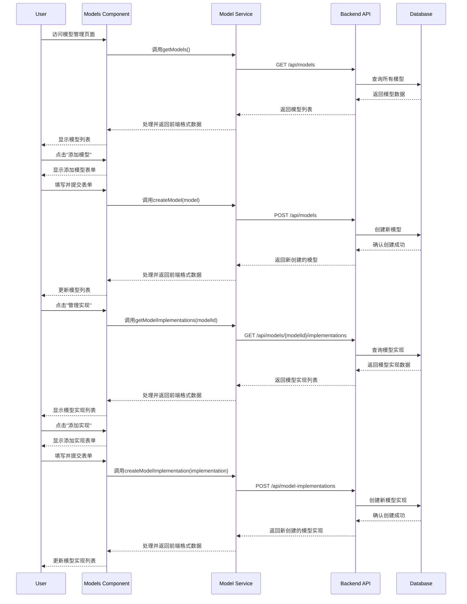
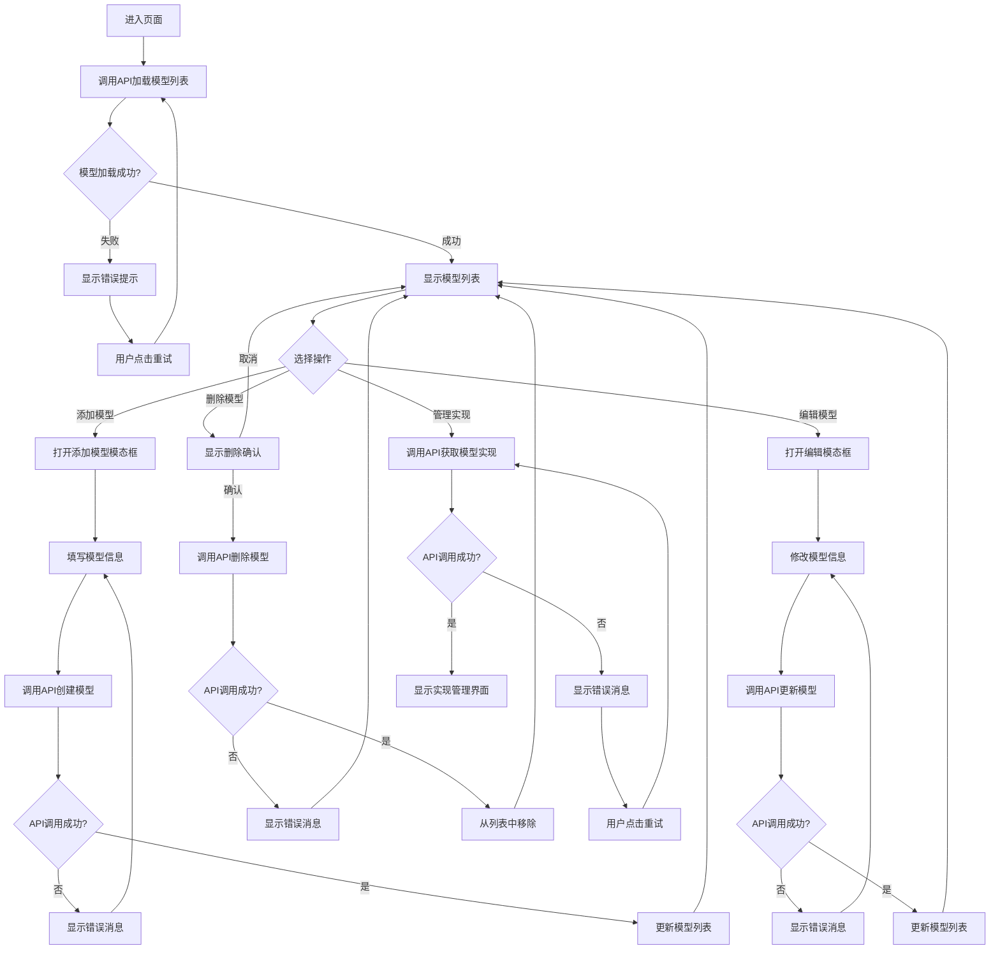
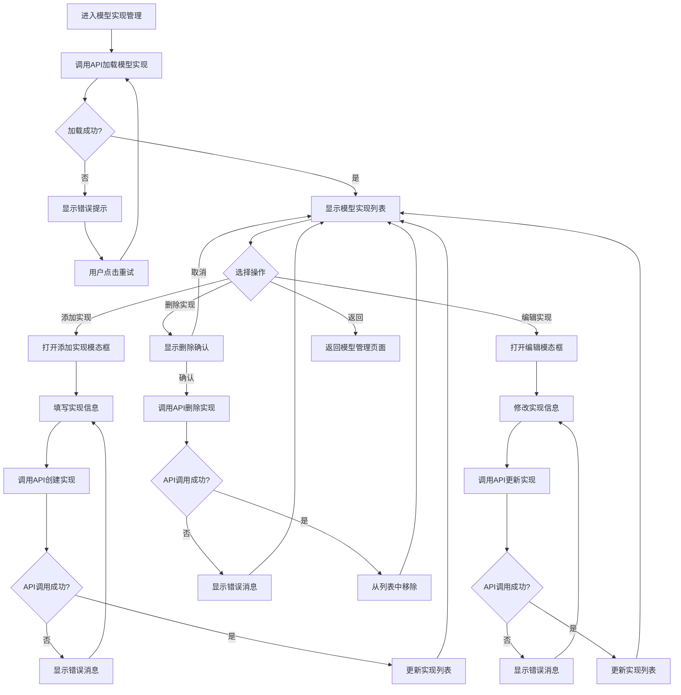

# 模型管理页面

## 系统架构概述

模型管理页面提供了对LLM模型及其不同实现的管理功能。页面通过后端API与数据库交互，实现模型和模型实现的增删改查操作。

## 数据模型类图


> For Examples:
### GPT-4o的不同实现
```yaml
Model: 
  id: "gpt-4o"
  name: "GPT-4o"
  family: "GPT-4"
  capabilities: ["text-generation", "function-calling"]

ModelImplementations:
  # OpenAI提供的两种不同级别的GPT-4o
  - providerId: "openai"
    modelId: "gpt-4o"
    providerModelId: "gpt-4o" 
    version: "2023-05"
    
  - providerId: "openai"
    modelId: "gpt-4o"
    providerModelId: "gpt-4o-mini" 
    version: "2023-05"
    
  # Azure提供的GPT-4o部署
  - providerId: "azure"
    modelId: "gpt-4o"
    providerModelId: "deployment-gpt4o"
    version: "2023-05"
```

## 前后端数据交互



## 模型管理流程图



## 模型实现管理流程图



## API与错误处理

模型管理页面集成了完善的错误处理机制：

1. **错误状态管理**：使用React状态管理错误消息，并在UI中展示友好的错误提示
2. **重试机制**：提供重试按钮，允许用户在遇到API错误时重新加载数据
3. **加载状态指示**：在异步操作过程中显示加载状态，提高用户体验

API调用通过专门的服务层（modelService）进行封装，实现前后端数据格式的转换与统一错误处理。

## 定价信息结构

```TypeScript
interface PricingInfo {
  // 基础计费信息
  currency: string; // 货币单位，如 "USD", "CNY"
  billingMode: "token" | "request" | "minute" | "hybrid"; // 计费模式
  
  // 基于Token的计费
  inputPrice?: number; // 每千输入token的价格
  outputPrice?: number; // 每千输出token的价格
  
  // 基于请求的计费
  requestPrice?: number; // 每次请求的价格
  
  // 基于时间的计费（如语音/视频模型）
  minutePrice?: number; // 每分钟的价格
  
  // 分级定价
  tiers?: {
    tierName: string; // 如 "Free", "Standard", "Premium"
    volumeThreshold: number; // 用量阈值
    inputPrice?: number; // 此级别的输入价格
    outputPrice?: number; // 此级别的输出价格
    requestPrice?: number; // 此级别的请求价格
  }[];
  
  // 附加功能定价
  specialFeatures?: {
    featureName: string; // 如 "function-calling", "vision", "embedding"
    additionalPrice: number; // 附加价格
    priceUnit: string; // 价格单位，如 "per request", "per 1K tokens"
  }[];
  
  // 免费额度信息
  freeAllowance?: {
    tokens?: number; // 免费token数量
    requests?: number; // 免费请求数量
    validPeriod?: string; // 有效期，如 "daily", "monthly"
  };
  
  // 额外信息
  minimumCharge?: number; // 最小收费金额
  effectiveDate?: string; // 价格生效日期
  notes?: string; // 额外说明
}
```

