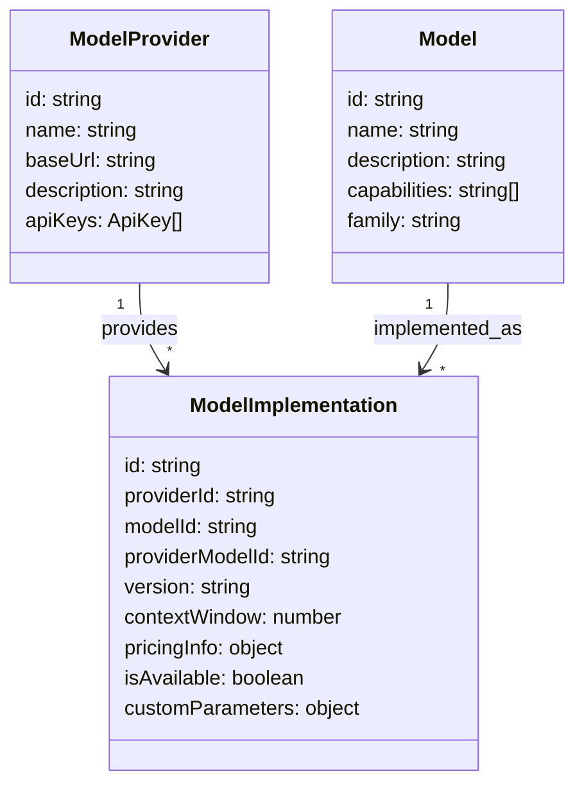
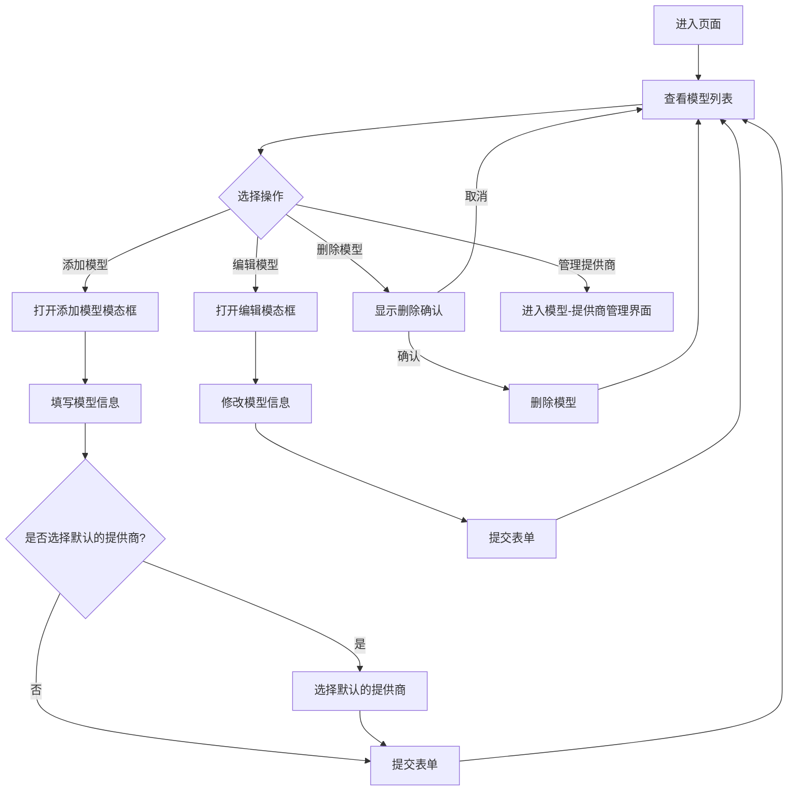
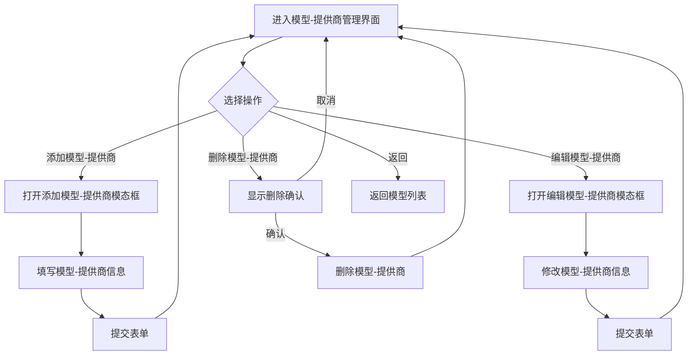

# 模型管理页面


## 数据模型类图


> For Examples:
### GPT-4o的不同实现
```yaml
Model: 
  id: "gpt-4o"
  name: "GPT-4o"
  family: "GPT-4"
  capabilities: ["text-generation", "function-calling"]

ModelImplementations:
  # OpenAI提供的两种不同级别的GPT-4o
  - providerId: "openai"
    modelId: "gpt-4o"
    providerModelId: "gpt-4o" 
    version: "2023-05"
    
  - providerId: "openai"
    modelId: "gpt-4o"
    providerModelId: "gpt-4o-mini" 
    version: "2023-05"
    
  # Azure提供的GPT-4o部署
  - providerId: "azure"
    modelId: "gpt-4o"
    providerModelId: "deployment-gpt4o"
    version: "2023-05"
```


## 模型管理流程图



## 模型-提供商管理流程


